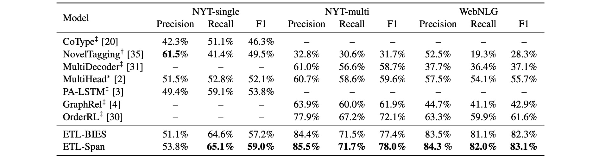
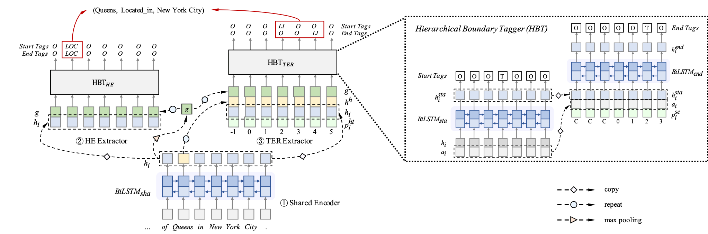

Joint Extraction of Entities and Relations Based on a Novel Decomposition Strategy
==========

This code is for ECAI 2020 paper "Joint Extraction of Entities and Relations Based on a Novel Decomposition Strategy", in which we first decompose the joint extraction task into two interrelated subtasks, namely HE extraction and TER extraction. The former subtask is to distinguish all head-entities that may be involved with target relations, and the latter is to identify corresponding tail-entities and relations for each extracted head-entity. Next, these two subtasks are further deconstructed into several sequence labeling problems based on our proposed span-based tagging scheme, which are conveniently solved by a hierarchical boundary tagger and a multi-span decoding algorithm. Experimental results show that our method outperforms previous work by 5.2%, 5.9% and 21.5% (F1 score), achieving a new state-of-the-art on three public datasets as follows:



You can find the paper [here](https://yubowen-ph.github.io/files/2020_ECAI_ETL/ETL.pdf)

See below for an overview of the model architecture:



## Requirements

Our model was trained on GPU GeForce 2080 RTX Ti.  

- Python 3 (tested on 3.6.8)

- PyTorch (tested on 1.0.1)

- CUDA (tested on 9.0.176)

- unzip, wget (for downloading only)

## Preparation

The pre-processed JSON files of NYT-multi and WebNLG have been put under the directory `dataset/NYT-multi/data` and `dataset/WebNLG/data`, respectively.


First, download and unzip GloVe vectors:

```
chmod +x download.sh; ./download.sh
```

  

Then prepare vocabulary, initial word vectors and tagging scheme of NYT-multi with:

```
python prepare_vocab.py --data_dir dataset/NYT-multi/data --vocab_dir dataset/NYT-multi/vocab
```

Similar operation can also be applied to the WebNLG dataset.

## Training

  

To train the model on the NYT-multi dataset, run:

```
python train.py --data_dir dataset/NYT-multi/data --vocab_dir dataset/NYT-multi/vocab --id multi 
```

  

Model checkpoints, logs and the output file of dev setwill be saved to `./saved_models/multi`.

  

For details on the use of other parameters, please refer to `train.py`.

  

## Evaluation

After training, our pretrained model is saved under the dir saved_models/multi. To run evaluation on the test set, run:

  
```
python eval.py saved_models/multi --data_dir dataset/NYT-multi/data --dataset test
```

  
This will use the `best_model.pt` file by default. Use `--model checkpoint_epoch_10.pt` to specify a model checkpoint file.

## Related Repo

 Codes are adapted from the repo of [Position-aware Attention and Supervised Data Improve Slot Filling](https://github.com/yuhaozhang/tacred-relation). We obtained the original datasets of NYT-multi and WebNLG from [Extracting Relational Facts by an End-to-End Neural Model with Copy Mechanism](https://github.com/xiangrongzeng/copy_re), and pre-processed them with StanfordCoreNLP.
 

## Citation

```
@inproceedings{yu2020jointer,
 author = {Bowen, Yu and Zhenyu, Zhang and Xiaobo, Shu and Yubin, Wang and Tingwen, Liu and Bin, Wang and Sujian, Li},
 booktitle = {Proc. of ECAI},
 title = {Joint Extraction of Entities and Relations Based on a Novel Decomposition Strategy},
 year = {2020}
}
```